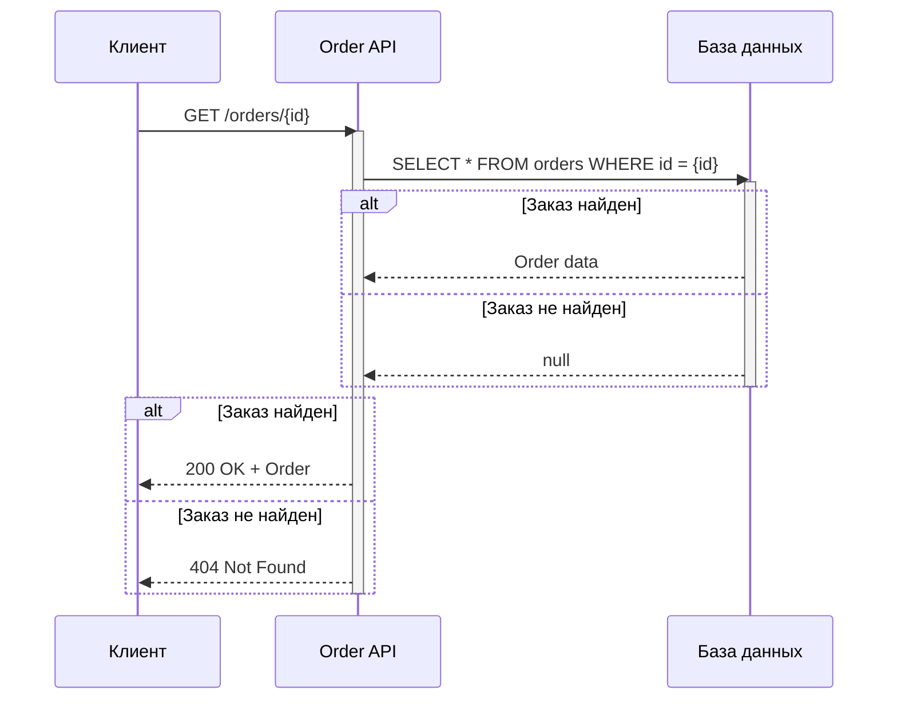
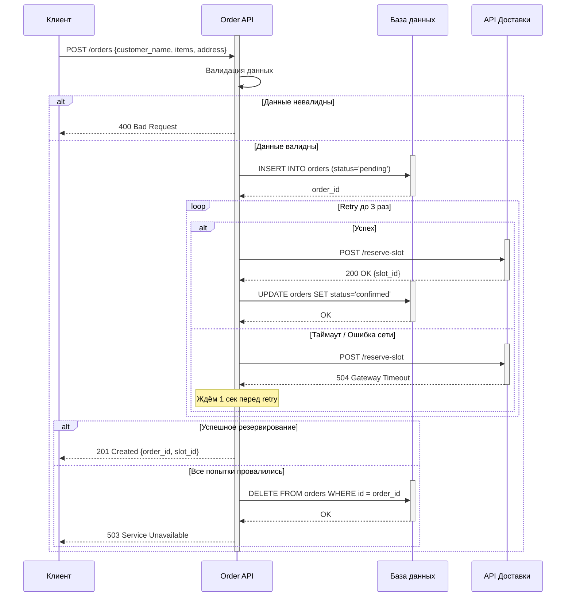

# Решение: Система управления заказами

## 1. Диаграмма последовательности для GET /orders/{id}

## 2. Диаграмма последовательности для POST /orders

## 3. Таблица контрактов API

**GET /orders/{id}**
| Имя параметра | Тип данных | Обязательность | Описание |
| :--- | :--- | :--- | :--- |
| **Входные** |
| *id (path)* | *integer* | *Да* | *ID заказа* |
| *Выходные (200 OK)* |
| *order_id* | *integer* | *Да* | *ID заказа* |
| *customer_name* | *string* | *Да* | *Имя клиента* |
| *items* | *array* | *Да* | *Список товаров* |
| *status* | *string* | *Да* | *Статус заказа (pending/confirmed)* |
| *slot_id* | *string* | *Нет* | *ID слота доставки (если подтверждён)* |
| **Выходные  (404 Not Found)** |
| *error* | *integer* | *Да* | *Сообщение об ошибке ("Order not found")* |

**POST /orders**
| Имя параметра | Тип данных | Обязательность | Описание |
| :--- | :--- | :--- | :--- |
| **Входные** |
| *customer_name* | *string* | *Да* | *Имя клиента* |
| *items* | *array* | *Да* | *Список товаров* |
| *items[].product_id* | *integer* | *Да* | *ID товара* |
| *items* | *integer* | *Да* | *Количество* |
| *address* | *string* | *Да* | *Адрес доставки* |
| **Выходные (201 Created)** |
| *order_id* | *integer* | *Да* | *ID заказа* |
| *slot_id* | *string* | *Да* | *ID слота доставки* |
| *status* | *string* | *Да* | *Статус заказа* |
| **Выходные  (404 Not Found)** |
| *error* | *integer* | *Да* | *Сообщение об ошибке валидации* |
| **Выходные (503 Service Unavailable)** |
| *error* | *integer* | *Да* | *Сообщение об ошибке ("Delivery service unavailable")* |

## 4. Таблица маппинга

| Наше поле (Order API) | Поле API Доставки | Преобразование |
| :--- | :--- | :--- |
| *order_id* | *external_order_id* | *Конвертация int → string* |
| *address* | *delivery_address* | *Без изменений* |
| *items[].weight* | *total_weight* | *Сумма весов всех товаров (items × quantity)* |
| *customer_name* | *recipient_name* | *Без изменений* |
| *-* | *priority* | *По умолчанию: "standard"* |
| *-* | *request_id* | *Генерация нового UUID для идемпотентности* |
| *order_id* | *callback_url* | *Формирование URL* |