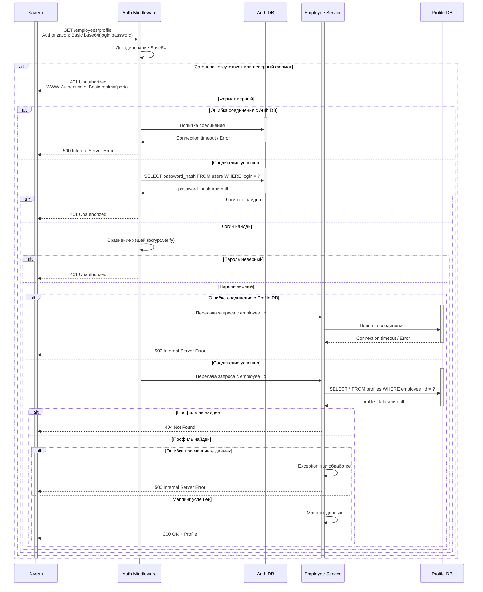

# Решение: Корпоративный портал профилей

## 1.Диаграмма последовательности для GET /employees/profile

## 2. Таблица контрактов API

### Входные параметры (Input)

| Параметр | Тип | Обязательный | Описание |
|---|---|---|---|
| `Authorization` | string | Да | Заголовок авторизации |
| Содержимое заголовка (декодированное) | string | Да | `login:password` |
| `login` | string | Да | Логин сотрудника |
| `password` | string | Да | Пароль сотрудника |

### Выходные параметры (Output)

| HTTP-код | Параметр | Тип | Описание |
|---|---|---|---|
| **200 OK** | `id` | integer | ID сотрудника |
|  | `full_name` | string | ФИО |
|  | `email` | string | Корпоративная почта |
|  | `position` | string | Должность |
|  | `department_name` | string | Название отдела |
|  | `hire_date` | string (date) | Дата найма (YYYY-MM-DD) |
|  | `phone` | string | Рабочий телефон |
| **401 Unauthorized** | `error` | string | Сообщение об ошибке |
|  | `www_authenticate` | string | `Basic realm="portal"` |
| **404 Not Found** | `error` | string | "Profile not found" |
| **500 Internal Server Error** | `error` | string | Сообщение об ошибке |

## 3. Таблица маппинга данных

| Наше поле (Profile DB) | Поле API | Преобразование |
|---|---|---|
| `employee_id` | `id` | Переименование |
| `first_name` + `last_name` + `middle_name` | `full_name` | Объединение строк |
| `email` | `email` | Без изменений |
| `position_id` | `position` | JOIN со справочником `positions`: получаем `position_name` |
| `department_id` | `department_name` |JOIN со справочником `departments`: получаем `department_name` |
| `hire_date` | `hire_date` | Форматирование даты в `YYYY-MM-DD` |
| `phone` | `phone` | Без изменений |
| `password_hash` | НЕ возвращается | Удаляется из ответа |
| `is_active` | НЕ возвращается | Удаляется из ответа |