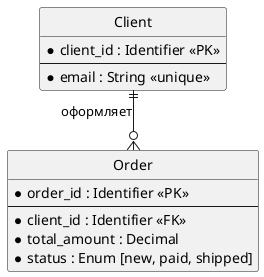

# 📚 Теоретическая справка: Уровни моделирования данных в System Design

## Введение: Зачем нам вообще три уровня?

Представьте, что вы проектируете интернет-магазин. 
* Если вы покажете **бизнес-заказчику** схему с `VARCHAR(255)`, `B-Tree индексами` и `PARTITION BY RANGE`, он ничего не поймет и не согласует бюджет.
* Если вы покажете **DBA (администратору БД)** схему, где просто нарисованы квадратики `[Клиент]` и `[Заказ]` со стрелочкой, он не сможет создать базу данных и оптимизировать её под нагрузку в 10 000 RPS.

Поэтому в индустрии принят **пошаговый процесс (Lifecycle)** перехода от абстракции к бетону. Он состоит из трех уровней: **Conceptual → Logical → Physical**.

> ⚠️ **Важно:** Не путайте этот *процесс проектирования* с академическим стандартом *ANSI/SPARC* (разберем в конце). На 99% собеседований и рабочих задач от вас ожидают именно прикладные уровни C-L-P.

---

## 1. Концептуальная ERD

### Основная идея

Концептуальная модель нужна, чтобы согласовать бизнес-понятия, границы домена и основные объекты предметной области. Она должна быть понятна нетехническим участникам: продукт-менеджерам, бизнес-заказчикам, аналитикам, архитекторам.

Критерий качества:  
**бизнес-стейкхолдер должен читать модель без перевода и понимать, о каких объектах и связях идёт речь.**

---

### Аудитория

Должно быть понятно:

- бизнес-стейкхолдерам;
- продукт-менеджерам;
- бизнес-аналитикам;
- архитекторам на этапе обсуждения домена;
- domain experts.

Если модель вызывает споры про `VARCHAR`, индексы, `UUID`, `JSONB`, партиции — это уже не концептуальный уровень.

---

### Что обязательно указывать

На концептуальном уровне должны быть:

1. **Ключевые бизнес-сущности**  
   Например:
   - `Клиент`
   - `Заказ`
   - `Товар`
   - `Платёж`
   - `Доставка`

   Сущности должны быть названы в терминах предметной области, желательно в единственном числе.

2. **Связи между сущностями**  
   Связи описываются как бизнес-отношения, часто глаголами:
   - `Клиент оформляет Заказ`
   - `Заказ содержит Товар`
   - `Платёж относится к Заказу`
   - `Доставка назначается на Заказ`

3. **Границы домена или контекста**  
   Если модель большая, полезно показать области:
   - `Каталог`
   - `Заказы`
   - `Платежи`
   - `Логистика`
   - `Клиенты`

   Это помогает понять, где заканчивается один контекст и начинается другой.

---

### Что допустимо указывать

Допустимо, но не обязательно:

1. **Один ключевой бизнес-идентификатор**, если он важен для обсуждения.  
   Например:
   - `Номер заказа`
   - `Артикул товара`
   - `Номер клиента`
   - `Email клиента`

   Но это должен быть именно бизнес-идентификатор, а не технический `id`.

2. **Высокоуровневые бизнес-правила в текстовом виде**.  
   Например:
   - «Один клиент может оформить несколько заказов»
   - «Заказ может содержать несколько товаров»
   - «Товар может входить в разные заказы»

   Но такие правила лучше писать как примечания, а не как формальную нотацию ERD.

---

### Что запрещено или нежелательно

На концептуальном уровне не должно быть:

- полного списка атрибутов;
- колонок;
- типов данных;
- первичных и внешних ключей в техническом смысле;
- `PK`, `FK`;
- кардинальности в формальной нотации, если вы следуете критерию «без типов связей»;
- индексов;
- партиционирования;
- ограничений уровня БД;
- названий таблиц;
- названий СУБД;
- SQL/DDL;
- `VARCHAR`, `UUID`, `JSONB`, `TIMESTAMPTZ`;
- физической денормализации;
- технических служебных полей вроде `created_at`, `updated_at`, если они не являются бизнес-понятиями.

**Пример:**
```plantuml
@startchen
left to right direction

entity Клиент {
}
entity Заказ {
}
entity Товар {
}

relationship Делает {
}

relationship Содержит {
}

Клиент -- Делает
Делает -- Заказ

Заказ -- Содержит
Содержит -- Товар

@endchen

```

---

## 🟡 Уровень 2. Логическая модель (Logical ERD) ⭐️
### Основная идея

Логическая модель — это основной уровень для System Design.  
Она описывает структуру данных, атрибуты, ключи, связи, кардинальность и правила целостности, но остаётся независимой от конкретной СУБД.

Критерий качества:  
**модель можно реализовать в PostgreSQL, MySQL, Oracle, SQL Server или другой реляционной СУБД без изменения смысла структуры данных.**

---

### Аудитория

Логическая модель предназначена для:

- системных архитекторов;
- тимлидов;
- backend-разработчиков;
- аналитиков;
- инженеров, проектирующих API, сервисы и хранение данных.

Она уже техническая, но ещё не привязана к конкретной базе данных.

---

### Что обязательно указывать

#### 1. Все сущности, нужные для функциональных требований

Например:

- `Client`
- `Order`
- `OrderItem`
- `Product`
- `Payment`
- `Delivery`
- `Category`
- `Warehouse`

Если связь many-to-many, должна быть промежуточная сущность.
Например:

```text
Order *--* Product
```

в логической модели превращается в:

```text
Order 1--* OrderItem *--1 Product
```

То есть появляется `OrderItem`.

---

#### 2. Атрибуты сущностей

Для полной логической модели нужно указывать все значимые атрибуты, которые требуются для реализации бизнес-требований.

Например:

```text
Client:
- client_id
- full_name
- email
- phone
- created_at

Order:
- order_id
- client_id
- status
- total_amount
- created_at

OrderItem:
- order_id
- product_id
- quantity
- unit_price

Product:
- product_id
- sku
- name
- price
```

В интервью по System Design иногда показывают только ключевые атрибуты, но если артефакт называется полной логической ERD, он должен содержать все необходимые атрибуты.

---

#### 3. Первичные ключи

Каждая сущность должна иметь первичный ключ.

Например:

```text
Client.client_id — PK
Order.order_id — PK
Product.product_id — PK
OrderItem(order_id, product_id) — composite PK
```

На логическом уровне важно показать, что сущность идентифицируема.

---

#### 4. Внешние ключи

Связи должны быть выражены через внешние ключи.

Например:

```text
Order.client_id -> Client.client_id
OrderItem.order_id -> Order.order_id
OrderItem.product_id -> Product.product_id
```

Если связь не выражена ключом, она остаётся просто картинкой, а не логической моделью данных.

---

#### 5. Кардинальность и обязательность связей

Нужно указать:

- one-to-one;
- one-to-many;
- many-to-many;
- обязательная связь или необязательная.

Например:

```text
Client 1 ── 0..* Order
Order 1 ── 1..* OrderItem
Product 1 ── 0..* OrderItem
```

Или текстом:

- один клиент может иметь ноль или более заказов;
- заказ обязательно принадлежит клиенту;
- заказ содержит минимум одну позицию;
- одна позиция заказа относится ровно к одному товару;
- товар может входить в ноль или более позиций заказов.

---

#### 6. Абстрактные типы данных

Логическая модель не должна содержать специфичные типы конкретной СУБД.

Можно использовать абстрактные типы:

- `Identifier`
- `String`
- `Text`
- `Integer`
- `Decimal`
- `Boolean`
- `Date`
- `Time`
- `Timestamp` / `DateTime`
- `Enum`
- `URL`
- `Email`
- `Phone`
- `Binary`
- `Reference`

Пример:

```text
Client.email: String
Order.total_amount: Decimal
Order.created_at: Timestamp
Product.price: Decimal
OrderItem.quantity: Integer
```

Нельзя писать:

```text
VARCHAR(255)
JSONB
NUMERIC(12,2)
BIGINT
TIMESTAMPTZ
UUID
TEXT
DATETIME2
```

Потому что это уже физическая реализация.

---

#### 7. Логические ограничения целостности

На логическом уровне нужно показывать не синтаксис ограничений, а их смысл.

Например:

- email уникален;
- SKU уникален;
- количество товара больше нуля;
- цена не отрицательная;
- статус заказа входит в допустимый набор значений;
- заказ не может существовать без клиента;
- позиция заказа не может существовать без заказа и товара;
- удаление клиента с заказами запрещено без отдельного бизнес-процесса.

Это уже потом превратится в `UNIQUE`, `CHECK`, `NOT NULL`, `FOREIGN KEY`, но на логическом уровне формулируем без DDL.

---

#### 8. Нормализация

Логическая модель должна быть спроектирована так, чтобы:

- минимизировать избыточность;
- избежать аномалий вставки, обновления и удаления;
- обеспечить целостность данных;
- устранить дублирование атрибутов;
- вынести повторяющиеся группы в отдельные сущности;
- разрешить many-to-many связи через промежуточные таблицы.

Обычно ожидаемый ориентир — **3NF**, если нет осознанной причины для другой структуры.

Если вы сознательно делаете денормализацию уже на логическом уровне, это нужно явно обосновать. Но чаще денормализация — уже физический уровень.

---

### Что допустимо указывать

Допустимо:

1. **Бизнес-ограничения длины**, если они важны как правило.  
   Например:
   - `phone maxLength 20`
   - `currency code length 3`
   - `SKU maxLength 50`

   Но лучше формулировать как ограничение, а не как `VARCHAR(20)`.

2. **Доменные справочники**.  
   Например:
   - `OrderStatus`
   - `PaymentStatus`
   - `Currency`
   - `Country`
   - `Category`

3. **Решение о типе ключа**:
   - surrogate key;
   - natural key;
   - composite key.

   Но без конкретной генерации `UUID`, `SEQUENCE`, `AUTO_INCREMENT`.

4. **Аудит-атрибуты**, если они нужны бизнесу или регуляторике:
   - `created_at`
   - `updated_at`
   - `created_by`
   - `updated_by`

   Но на логическом уровне это абстрактные `Timestamp`, `Identifier`, а не конкретные SQL-поля.

---

### Что запрещено

Логическая ERD не должна содержать:

- `VARCHAR(255)`;
- `TEXT`;
- `JSONB`;
- `UUID`;
- `BIGINT`;
- `SERIAL`;
- `IDENTITY`;
- `TIMESTAMPTZ`;
- `NUMERIC(12,2)`;
- PostgreSQL-специфичных типов;
- MySQL-специфичных типов;
- MongoDB-специфичных структур;
- DDL;
- индексов;
- партиционирования;
- шардирования;
- tablespace;
- storage engine;
- материализованных представлений как физической оптимизации;
- конкретных индексов;
- физических стратегий хранения;
- привязки к конкретной СУБД.

Если появляется фраза:

> Используем `JSONB`, потому что PostgreSQL удобно хранит полу-структурированные данные.

это уже физический уровень.

---

### Как проверить цель уровня

Цель логической модели:  
**спроектировать корректную структуру данных, выявить избыточность и обеспечить целостность.**

Проверочные вопросы:

- Понятно ли, какие данные хранятся?
- У каждой сущности есть ключ?
- Связи выражены явно?
- Кардинальность понятна?
- Many-to-many разрешены?
- Есть ли избыточность?
- Можно ли реализовать эту модель в любой реляционной СУБД?
- Понятны ли правила целостности?
- Можно ли по этой модели построить API и сервисную логику?

Если да — уровень логический.

---

### Пример логической ERD



Здесь нет PostgreSQL, MySQL, MongoDB, индексов, `VARCHAR`, `JSONB`, партиций. Это именно логическая модель.

---

## 🔴 Уровень 3. Физическая модель (Physical ERD)
### Основная идея

Физическая модель описывает, как данные будут храниться в конкретной базе данных с учётом производительности, нагрузки, объёмов и эксплуатационных требований.

Критерий качества:  
**DBA или backend-инженер может взять эту модель и создать рабочую схему БД, понимая, почему выбраны именно такие типы, индексы и ограничения.**

---

### Аудитория

Физическая модель нужна:

- DBA;
- backend-разработчикам;
- platform-инженерам;
- инженерам по производительности;
- архитекторам, принимающим решения по хранению;
- DevOps/SRE, если важны_partitioning, retention, storage, backup.

---

### Что обязательно указывать

#### 1. Целевую СУБД

Физическая модель без указания СУБД неполная.

Нужно указать, например:

- PostgreSQL 16;
- MySQL 8, InnoDB;
- MongoDB 7;
- ClickHouse;
- Cassandra;
- Redis, если это осознанная модель хранения;
- DynamoDB, если проектируются ключи доступа.

Если написано просто «физическая схема», но непонятно, для какой СУБД, это плохая физическая модель.

---

#### 2. Конкретные имена таблиц, коллекций или объектов

Логические сущности превращаются в физические объекты:

```text
Client -> client
Order -> orders
OrderItem -> order_item
Product -> product
```

Для NoSQL:

```text
Client -> users collection
Order -> orders collection
Product -> products collection
```

---

#### 3. Конкретные типы данных

Теперь можно и нужно писать реальные типы.

Для PostgreSQL:

```sql
BIGINT
INTEGER
TEXT
VARCHAR(255)
NUMERIC(12,2)
BOOLEAN
DATE
TIMESTAMP
TIMESTAMPTZ
UUID
JSONB
BYTEA
```

Для MySQL:

```sql
BIGINT UNSIGNED
VARCHAR(255)
DECIMAL(12,2)
DATETIME(6)
JSON
ENUM
```

Для MongoDB:

```json
{
  "orderId": "objectId",
  "clientId": "objectId",
  "status": "string",
  "totalAmount": "decimal",
  "createdAt": "date"
}
```

---

#### 4. Первичные и внешние ключи в физической реализации

Для реляционной БД:

```sql
PRIMARY KEY
FOREIGN KEY
REFERENCES
ON DELETE CASCADE
ON DELETE RESTRICT
ON UPDATE RESTRICT
```

Для NoSQL внешние ключи могут отсутствовать, тогда нужно явно указать стратегию:

- embedding;
- referencing;
- денормализация;
- application-level enforcement;
- lookup collection;
- shard key reference.

---

#### 5. Конкретные ограничения

Например:

```sql
UNIQUE
CHECK
NOT NULL
DEFAULT
EXCLUDE
GENERATED ALWAYS AS
```

Пример:

```sql
CONSTRAINT order_item_quantity_positive
CHECK (quantity > 0)
```

Или в MongoDB:

```json
{
  "$jsonSchema": {
    "required": ["orderId", "clientId", "status"],
    "properties": {
      "status": {
        "enum": ["new", "paid", "shipped", "cancelled"]
      }
    }
  }
}
```

---

#### 6. Индексы

Это уже физический уровень.

Например:

```sql
CREATE INDEX idx_orders_client_id ON orders(client_id);
CREATE UNIQUE INDEX idx_product_sku ON product(sku);
CREATE INDEX idx_order_item_order_id ON order_item(order_id);
```

Для MongoDB:

```javascript
db.orders.createIndex({ clientId: 1, createdAt: -1 });
db.products.createIndex({ sku: 1 }, { unique: true });
```

Индексы должны соответствовать ожидаемым запросам.

Например:

- поиск заказов клиента;
- поиск товара по SKU;
- выборка позиций заказа;
- фильтрация по статусу;
- отчёты по дате;
- пагинация;
- поиск по email.

Если в System Design заявлена высокая нагрузка, но нет индексов под основные запросы — физическая модель неполная.

---

#### 7. Партиционирование, шардирование, retention

Если объём данных большой, нужно указать:

- партиционирование по дате;
- range partitioning;
- hash partitioning;
- list partitioning;
- shard key;
- retention policy;
- TTL;
- архивацию;
- hot/warm/cold storage.

Пример для PostgreSQL:

```sql
CREATE TABLE orders (
    order_id BIGINT,
    created_at TIMESTAMPTZ NOT NULL,
    ...
) PARTITION BY RANGE (created_at);
```

Для MongoDB:

```javascript
db.orders.createIndex({ createdAt: 1 }, { expireAfterSeconds: 7776000 });
```

Для Cassandra/DynamoDB важно указать partition key и clustering key, потому что от них зависит производительность.

---

#### 8. Денормализацию и её обоснование

Физический уровень может сознательно нарушать нормализацию ради производительности.

Например:

```text
Храним total_amount в заказе, чтобы не пересчитывать сумму по order_item при каждом чтении.
```

Или:

```text
Храним snapshot названия товара и цены в order_item, потому что исторические заказы не должны меняться после изменения карточки товара.
```

Но денормализация всегда должна иметь обоснование:

- ускоряет чтение;
- уменьшает количество join'ов;
- соответствует паттерну доступа;
- обеспечивает историческую корректность;
- снижает нагрузку;
- упрощает репликацию.

Без обоснования денормализация выглядит как ошибка проектирования.

---

#### 9. Представления и материализованные представления

Если они используются для:

- API;
- отчётов;
- аналитики;
- кэширования;
- упрощения запросов;
- скрытия сложности;
- производительности.

Например:

```sql
CREATE VIEW active_orders AS
SELECT *
FROM orders
WHERE status NOT IN ('cancelled');
```

Или:

```sql
CREATE MATERIALIZED VIEW daily_sales AS
SELECT date_trunc('day', created_at) AS day,
       sum(total_amount) AS revenue
FROM orders
GROUP BY 1;
```

В ANSI/SPARC представления могут также относиться к внешнему уровню, но в вашей формулировке их разумно рассматривать как элемент физической реализации.

---

### Что допустимо указывать

Допустимо и часто полезно:

- sequence;
- identity columns;
- default values;
- generated columns;
- triggers;
- stored procedures, если они нужны для целостности;
- collation;
- charset;
- timezone policy;
- compression;
- tablespace;
- storage parameters;
- JSONB structures;
- arrays;
- GIN/GiST индексы;
- partial indexes;
- covering indexes;
- TTL;
- shard key;
- репликация и read replicas, если влияют на схему.

---

### Что запрещено или является ошибкой

Физическая модель не должна быть:

1. **Без целевой СУБД.**  
   Плохо: «физическая схема» без указания PostgreSQL, MySQL, MongoDB и т.д.

2. **Только абстрактными типами.**  
   Если написано `String`, `Integer`, `Timestamp`, но нет реальных типов БД — это логическая модель.

3. **Без индексов при обсуждении производительности.**  
   Если вы говорите про high load, но не показываете индексы под ключевые запросы, физический уровень не раскрыт.

4. **С денормализацией без причины.**  
   Денормализация должна объясняться нагрузкой, паттернами доступа или требованиями к историчности данных.

5. **С забытыми ограничениями.**  
   Если в логической модели было `quantity > 0`, а в физической нет `CHECK`, значит целостность потеряна.

---

### Как проверить цель уровня

Цель физической модели:  
**оптимизировать производительность под конкретную нагрузку и целевую СУБД.**

Проверочные вопросы:

- Понятно ли, какая СУБД используется?
- Можно ли выполнить DDL?
- Есть ли типы данных под конкретную СУБД?
- Есть ли индексы под основные запросы?
- Есть ли ограничения целостности?
- Понятна ли стратегия первичных ключей?
- Есть ли партиционирование или шардирование при больших объёмах?
- Обоснована ли денормализация?
- Понятна ли политика хранения и архивации?
- Соответствует ли схема ожидаемой нагрузке?

Если да — уровень физический.

---

### Пример корректной физической ERD для PostgreSQL

```sql
CREATE TABLE client (
    client_id BIGINT GENERATED ALWAYS AS IDENTITY PRIMARY KEY,
    full_name TEXT NOT NULL,
    email TEXT NOT NULL,
    phone TEXT,
    created_at TIMESTAMPTZ NOT NULL DEFAULT now(),

    CONSTRAINT client_email_unique UNIQUE (email)
);

CREATE TABLE product (
    product_id BIGINT GENERATED ALWAYS AS IDENTITY PRIMARY KEY,
    sku TEXT NOT NULL,
    name TEXT NOT NULL,
    price NUMERIC(12,2) NOT NULL,
    created_at TIMESTAMPTZ NOT NULL DEFAULT now(),

    CONSTRAINT product_sku_unique UNIQUE (sku),
    CONSTRAINT product_price_not_negative CHECK (price >= 0)
);

CREATE TABLE orders (
    order_id BIGINT GENERATED ALWAYS AS IDENTITY PRIMARY KEY,
    client_id BIGINT NOT NULL,
    status TEXT NOT NULL,
    total_amount NUMERIC(12,2) NOT NULL,
    created_at TIMESTAMPTZ NOT NULL DEFAULT now(),

    CONSTRAINT orders_status_check
        CHECK (status IN ('new', 'paid', 'shipped', 'cancelled')),

    CONSTRAINT orders_total_amount_not_negative
        CHECK (total_amount >= 0),

    CONSTRAINT orders_client_fk
        FOREIGN KEY (client_id)
        REFERENCES client(client_id)
        ON DELETE RESTRICT
);

CREATE TABLE order_item (
    order_id BIGINT NOT NULL,
    product_id BIGINT NOT NULL,
    quantity INTEGER NOT NULL,
    unit_price NUMERIC(12,2) NOT NULL,

    CONSTRAINT order_item_pk
        PRIMARY KEY (order_id, product_id),

    CONSTRAINT order_item_order_fk
        FOREIGN KEY (order_id)
        REFERENCES orders(order_id)
        ON DELETE CASCADE,

    CONSTRAINT order_item_product_fk
        FOREIGN KEY (product_id)
        REFERENCES product(product_id)
        ON DELETE RESTRICT,

    CONSTRAINT order_item_quantity_positive
        CHECK (quantity > 0),

    CONSTRAINT order_item_unit_price_not_negative
        CHECK (unit_price >= 0)
);

CREATE INDEX idx_orders_client_id
    ON orders(client_id);

CREATE INDEX idx_orders_status_created_at
    ON orders(status, created_at DESC);

CREATE INDEX idx_order_item_product_id
    ON order_item(product_id);
```

Это уже физическая модель, потому что есть:

- PostgreSQL-типы;
- `TIMESTAMPTZ`;
- `NUMERIC(12,2)`;
- `GENERATED ALWAYS AS IDENTITY`;
- конкретные `CHECK`;
- конкретные `FOREIGN KEY`;
- индексы;
- ограничения на уровне БД.

---

## 🧠 Путаница с ANSI/SPARC

В академической литературе и старых учебниках вы можете встретить стандарт **ANSI/SPARC (1975 год)**. Он описывает не *процесс рисования схем*, а **внутреннюю архитектуру самой СУБД** для обеспечения независимости данных.

В ANSI/SPARC тоже три уровня, но они называются иначе и означают другое:
1. **External (Внешний):** То, как данные видит приложение (SQL `VIEW`, API DTO, GraphQL-схемы).
2. **Conceptual (Концептуальный):** Глобальная логика всей БД. *(Внимание: это то, что мы выше назвали **Логической** моделью!)*.
3. **Internal (Внутренний):** То, как данные лежат на диске (B-деревья, страницы памяти). *(Это наша **Физическая** модель)*.

---

## 📊 Шпаргалка: Сравнительная таблица

## Сводная таблица: что на каком уровне указывается

| Элемент | Концептуальная ERD | Логическая ERD | Физическая ERD |
|---|---:|---:|---:|
| Бизнес-сущности | Обязательно | Обязательно | Обязательно как таблицы/коллекции |
| Связи между сущностями | Обязательно как бизнес-отношения | Обязательно с кардинальностью | Обязательно как FK/references/embedding |
| Атрибуты | Нет или только бизнес-ключи | Обязательно все значимые | Обязательно как поля с типами |
| Полные списки полей | Нет | Да | Да |
| Первичные ключи | Только как бизнес-идентификаторы, опционально | Обязательно | Обязательно с конкретной реализацией |
| Внешние ключи | Нет | Обязательно | Обязательно или NoSQL-стратегия связей |
| Кардинальность | Не формализуется | Обязательно | Реализуется ограничениями/структурой |
| Обязательность связи | Можно текстом | Обязательно | Обязательно через `NOT NULL`, FK, validation |
| Типы данных | Нет | Абстрактные | Конкретные для СУБД |
| `VARCHAR`, `JSONB`, `UUID` | Нет | Нет | Да |
| Ограничения целостности | Можно как бизнес-правила | Обязательно логически | Обязательно как DB-ограничения |
| Нормализация | Не требуется | Обязательна | Может быть нарушена осознанно |
| Индексы | Нет | Нет | Да |
| Партиционирование | Нет | Нет | Да, если нужно |
| Шардирование | Нет | Нет | Да, если нужно |
| Денормализация | Нет | Только как исключение с обоснованием | Да, с обоснованием |
| Представления | Нет | Обычно нет | Да, если нужны для реализации/производительности |
| Привязка к СУБД | Нет | Нет | Обязательно |
| DDL | Нет | Нет | Да |
| Нагрузочные требования | Нет | Нет | Да как обоснование решений |
| Аудит-поля | Только если бизнес-понятия | Если требуются бизнесом/регуляторикой | С конкретными типами и default'ами |

---

## Короткий чек-лист по каждому уровню

### Концептуальная ERD

Проверяем:

- Есть только сущности и связи?
- Понятно ли это бизнесу?
- Нет ли технических терминов?
- Нет ли атрибутов, кроме редких бизнес-ключей?
- Нет ли `PK`, `FK`, типов, индексов?
- Можно ли использовать модель как глоссарий?

Если да — это концептуальный уровень.

---

### Логическая ERD

Проверяем:

- Есть все сущности?
- Есть атрибуты?
- Есть первичные ключи?
- Есть внешние ключи?
- Есть кардинальность?
- Есть обязательность связей?
- Есть абстрактные типы?
- Нет ли привязки к СУБД?
- Нет ли индексов и партиций?
- Модель нормализована?

Если да — это логический уровень.

---

### Физическая ERD

Проверяем:

- Указана ли СУБД?
- Есть ли конкретные типы данных?
- Есть ли реальные таблицы/коллекции?
- Есть ли конкретные ключи?
- Есть ли ограничения?
- Есть ли индексы?
- Есть ли объяснение под нагрузку?
- Есть ли партиционирование/шардирование, если нужно?
- Обоснована ли денормализация?
- Можно ли это развернуть?

Если да — это физический уровень.

---

## Типичные ошибки

### Ошибка 1: Концептуальная модель слишком техническая

Плохо:

```text
Client(client_id UUID PK, created_at TIMESTAMP)
Order(order_id BIGINT PK, client_id UUID FK)
```

Это уже логическая или физическая модель.

---

### Ошибка 2: Логическая модель содержит типы конкретной СУБД

Плохо:

```text
Client.email VARCHAR(255)
Order.metadata JSONB
Product.id UUID
```

Это физический уровень.

---

### Ошибка 3: Логическая модель без ключей и связей

Плохо:

```text
Client: name, email
Order: date, status
Product: name, price
```

Непонятно:

- где ключи;
- как связаны сущности;
- какая кардинальность;
- как обеспечивается целостность.

---

### Ошибка 4: Физическая модель без указания СУБД

Плохо:

```text
Таблица orders, поле status ENUM, индекс по client_id.
```

Нужно уточнить:

- PostgreSQL?
- MySQL?
- MongoDB?
- ClickHouse?
- DynamoDB?

Без этого физическая модель неполная.

---

### Ошибка 5: Физическая модель без индексов при высокой нагрузке

Если в условиях System Design есть:

- миллионы пользователей;
- тысячи RPS;
- большие таблицы;
- частые выборки по клиенту;
- отчёты по датам;
- поиск по статусу;

то физическая модель должна показывать индексы и стратегию доступа.

---

### Ошибка 6: Денормализация без обоснования

Плохо:

```text
Сохраним название товара в заказе, чтобы не делать join.
```

Хорошо:

```text
Сохраним snapshot названия товара и цены в order_item,
потому что заказы должны хранить историческое состояние товара,
а изменение карточки товара не должно менять старые заказы.
```

---

## Правило быстрой проверки

Если вы видите только:

```text
[Клиент] — делает — [Заказ] — содержит — [Товар]
```

это **концептуальный уровень**.

Если вы видите:

```text
Client(client_id PK, email UNIQUE)
Order(order_id PK, client_id FK)
OrderItem(order_id FK, product_id FK)
```

и абстрактные типы — это **логический уровень**.

Если вы видите:

```sql
BIGINT, VARCHAR(255), JSONB, TIMESTAMPTZ, CREATE INDEX, PARTITION BY
```

это **физический уровень**.